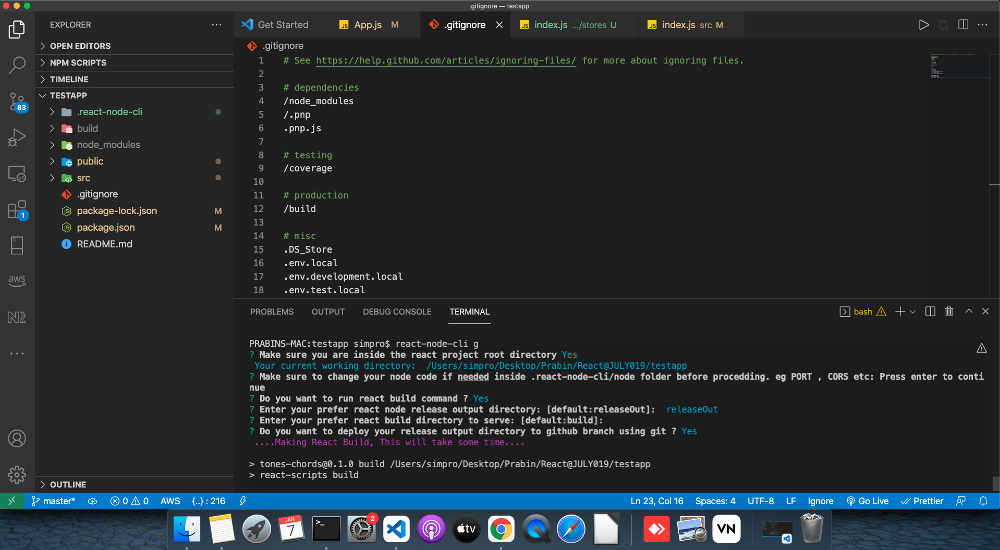
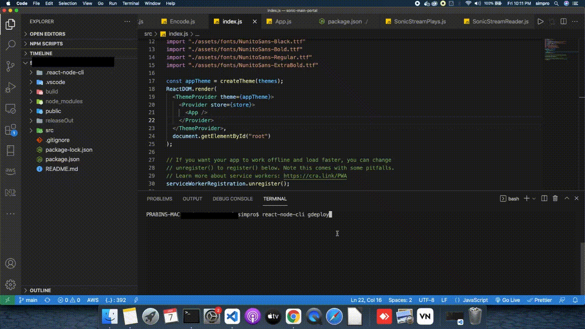

# React-Node CLI

This cli contains the core node js code to serve react build and commnads file to make a final release build with both node and react combined.


## Features

- Easy to convert your react app into  standalone full stack application.
- Automatically push your fullstack app to github branch.
- Single command to make build and release.
- Export industry level react project structure.
- Deploy any folder to github branch.

  
## Usage/Examples

### Installation

Install package

```sh
$ npm i -g @prabink/react-node-cli 
```

#### Now you can run the react-node-cli commands globally in your system

### Commands & Options

React Node Application Generator & Helpers To Serve React Build, Push to github & Export industry level react project structure 
```sh
$ react-node-cli --help
Options:
  -V, --version  output the version number
  -h, --help     output usage information

Commands:
  generate|g     Generate React Node Application
  export|exp     Export React Starter Structure
  git_deploy|gdeploy  Deploy any folder to github branch

```
## API Reference

### Generate
Generate react build and node server to serve your FullStack Node React Application 
in any Hosting provider. This will give you an options to push your fullstack source code 
to github branch.
```sh
$ react-node-cli g
         OR
$ react-node-cli generate
```
#### Example


### Export
Export industry level react project structure for your reference, 
This will extract all folder structure that you need to manage your highly scable react app.
This has 3 options for user while expoting: Eg
What you want to export? (Use arrow keys) (Use arrow keys)
❯ Export react structure only 
  Export react structure with materialUI & Mobx 
  Export react structure with materialUI & Redux 

```sh
$ react-node-cli export
              OR
$ react-node-cli exp
```
#### Example


### GIT DEPLOY
Deploy any folder to github branch 
This will allow you to choose any folder that you want to push into a github branch. 

```sh
$ react-node-cli git_deploy
              OR
$ react-node-cli gdeploy
```
#### Example


## Tech Stack

**Client:** React

**Server:** Node, Express, Git,
## Authors

- [@githubprabin143](https://github.com/githubprabin143/react-node-cli)

  
## License

[MIT](https://choosealicense.com/licenses/mit/)

  